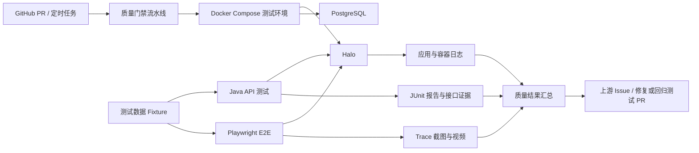
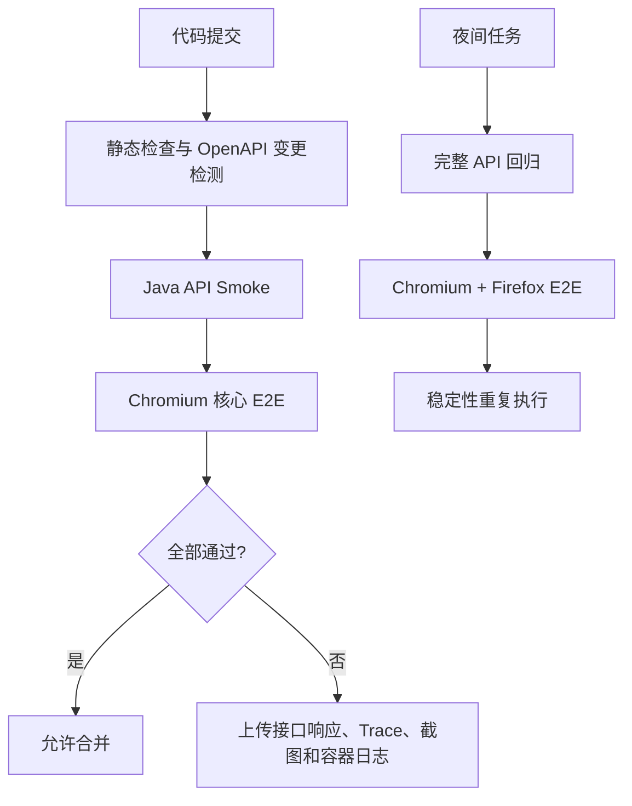

# Halo 开源系统全链路自动化测试与发布质量门禁

## 文档信息

- 日期：2026-08-31
- 状态：设计已确认，等待实现
- 项目类型：公开开源质量工程与上游贡献
- 目标岗位：校招测试开发工程师
- 被测项目：[halo-dev/halo](https://github.com/halo-dev/halo)
- 调研基线：`58fbb339d49511e221ec760478490e1c880f7d2a`

## 1. 项目背景

Halo 是一个真实的全栈开源建站系统。调研基线采用 Java 21、Spring Boot WebFlux、R2DBC、Vue 3 和 TypeScript，仓库已有后端 JUnit 测试、前端 Vitest 单元测试以及 GitHub Actions 构建和覆盖率流程。

在本次调研基线中，没有发现独立的 Playwright 或 Cypress 端到端测试配置，现有主 CI 也没有浏览器端到端阶段。本项目不评价上游整体质量，也不替代其已有测试；项目目标是建设一个外置、非侵入式的质量工程仓库，针对认证、内容生命周期、RBAC 权限和公开页面一致性提供可重复的 API 与浏览器测试，并通过公开 Issue 和 PR 参与上游质量改进。

第二个项目与风光设备接入验收平台形成互补：前者突出真实开源协作、接口与 UI 分层测试、质量门禁和稳定性治理；后者突出测试平台开发、消息链路、数据质量和性能测试。

## 2. 真实性与表述边界

该项目可以表述为：

> 面向 Java 开源建站系统 Halo 建设独立质量工程仓库，围绕认证、文章生命周期、RBAC 权限和公开页面一致性，实现 API 与浏览器端分层自动化测试、隔离测试环境和 CI 质量门禁，并通过公开 Issue 与 PR 参与上游质量改进。

必须根据公开记录区分以下状态：

- 已在个人仓库实现：可以写“设计并实现”。
- 已向上游创建 Issue：可以写“向上游提交缺陷报告或改进建议”。
- 已创建 PR 但未合并：只能写“向上游提交 PR”。
- PR 已合并：可以写“贡献被社区接受”并附链接。

不得虚构 Issue、PR、评审意见、合并状态、CI 次数、缺陷数量、覆盖率或性能结果。

## 3. 项目目标

### 3.1 核心目标

- 为固定 Halo 版本提供一键启动、可重复的隔离测试环境。
- 使用 Java API 测试覆盖状态、边界、权限和错误处理。
- 使用 Playwright 覆盖最重要的浏览器用户旅程。
- 验证管理接口、公开接口和前台页面之间的一致性。
- 使用唯一运行标识实现并行测试数据隔离与资源清理。
- 建立无默认重试的分层质量门禁和失败证据链。
- 建立不稳定用例识别、隔离、修复和恢复流程。
- 形成可公开验证的 Issue、PR、CI 和报告记录。

### 3.2 非目标

- 不追求覆盖 Halo 的所有接口和页面。
- 不把所有接口测试改写为 UI 测试。
- 不开发测试用例管理后台或质量大屏。
- 不直接修改 Halo 上游 CI 来强制引入 E2E 框架。
- 不对没有明确需求的模块进行大规模重构。
- 不依赖共享在线演示环境执行质量门禁。
- 不用无条件重试掩盖不稳定用例。

## 4. 总体架构



质量工程仓库与 Halo 上游仓库分离。外置仓库负责环境、黑盒 API 测试、浏览器 E2E、契约检查、报告和兼容记录；需要修改产品行为时，在 Halo Fork 中创建独立分支并按上游规范提交 PR。

## 5. 仓库结构

```text
halo-quality-engineering/
├─ environment/
│  ├─ docker-compose.yml
│  └─ halo-config/
├─ api-tests/
│  ├─ auth/
│  ├─ posts/
│  ├─ permissions/
│  ├─ comments/
│  └─ fixtures/
├─ e2e/
│  ├─ fixtures/
│  ├─ pages/
│  ├─ specs/
│  └─ playwright.config.ts
├─ contracts/
│  ├─ baseline/
│  └─ openapi-check/
├─ .github/workflows/
│  ├─ quality-gate.yml
│  └─ nightly.yml
├─ docs/
│  ├─ test-strategy.md
│  ├─ failure-triage.md
│  └─ upstream-contributions.md
└─ README.md
```

不建设额外 Web 管理页面。GitHub Summary、JUnit XML、Playwright HTML Report 和失败附件构成项目的操作与展示界面。

## 6. 模块边界

### 6.1 environment

固定 Halo 镜像、镜像摘要、PostgreSQL 配置和启动参数，负责健康检查、初始化及容器日志收集。首个兼容目标为 Halo `2.26`，后续版本通过显式兼容矩阵增加，不使用浮动 `latest` 标签。

### 6.2 api-tests

使用 Java 21、JUnit 5、RestAssured 和 AssertJ，覆盖认证、状态转换、权限矩阵、边界值、错误响应和并发更新。API 测试承担大部分状态组合，避免浏览器测试膨胀。

### 6.3 e2e

使用 Playwright 和 TypeScript，只覆盖核心用户旅程。定位优先使用 `getByRole`、`getByLabel` 和可访问名称，不使用脆弱的层级 CSS 选择器。

### 6.4 contracts

保存经人工确认的 OpenAPI 基线，并识别删除接口、删除字段、必填性变化和类型变化等破坏性差异。契约差异产生报告，不自动修改生成代码。

### 6.5 fixtures

Java 和 Playwright 分别实现轻量 API Fixture。二者共享 `runId` 命名约定、资源清单格式和清理协议，但不建设跨语言 Fixture 服务。

### 6.6 quality-gate

负责启动环境、执行分层测试、判断门禁结果、上传报告和销毁环境。环境启动失败与产品断言失败使用不同结果分类。

### 6.7 upstream-contributions

记录上游版本、复现步骤、Issue、PR、评审反馈、修改记录和最终状态。公开链接是简历成果的唯一事实依据。

## 7. 核心业务范围

### 7.1 认证与会话

- 管理员和普通用户登录成功。
- 错误密码、禁用用户和非法请求登录失败。
- 退出后会话失效。
- 会话过期后管理接口和页面均要求重新认证。
- 不同角色的认证状态彼此隔离。

### 7.2 文章生命周期

首期状态模型如下：

```text
DRAFT -> PUBLISHED -> UNPUBLISHED
   |          |
   |          -> RECYCLED
   -> RECYCLED
```

最终状态名称以被测版本 API 返回为准，但测试语义保持为草稿、已发布、取消发布和回收。

每次状态转换同时验证：

1. 管理接口返回的状态。
2. 公开内容接口是否可查询。
3. 前台页面是否可见。
4. 无权限角色执行相同操作时是否被拒绝。
5. 非法转换失败后原有状态是否保持不变。

### 7.3 RBAC 权限

首期至少覆盖管理员、内容作者和只读用户三类角色。

- 页面入口隐藏只能作为 UI 结果，不能替代后端权限断言。
- 未授权 API 操作必须返回明确拒绝结果。
- 被拒绝操作不能产生部分写入或状态变化。
- 同一资源由不同角色访问时验证可见字段和允许操作。

### 7.4 评论与附件

评论提交、审核、回复、关闭评论，以及附件上传、引用、删除和无权限访问属于 P1 范围。只有核心文章链路稳定后才扩展这些场景。

## 8. API 与 UI 分层策略

API 测试负责：

- 大量状态和权限组合。
- 参数边界、分页和筛选。
- 错误码和响应结构。
- 非法状态转换。
- 并发更新和幂等行为。
- 测试数据创建与清理。

Playwright 负责：

- 管理员登录并发布文章。
- 作者创建草稿并完成允许的操作。
- 发布内容在公开页面可见。
- 取消发布后公开页面不可见。
- 无权限用户无法进入或调用管理功能。
- 失败操作显示正确反馈且数据状态不被破坏。

浏览器测试通过 API 准备非关键前置条件，避免重复执行低价值 UI 步骤。

## 9. 测试数据隔离

每次运行生成唯一 `runId`。所有用户、文章、评论和附件名称均包含该标识。

隔离规则：

- 每次 CI 使用全新的 Halo 与 PostgreSQL 容器。
- 每个并行 Worker 使用独立账号和浏览器上下文。
- 不同角色分别保存 Playwright `storageState`。
- Fixture 创建资源时同步记录资源类型、名称和删除顺序。
- 本地运行完成后按照依赖关系逆序清理。
- CI 使用一次性环境，失败证据上传后直接销毁容器。
- 测试不直接修改业务数据库来构造状态。
- 测试名称和数据不依赖执行顺序。

测试失败时，资源清理失败不得覆盖原始断言失败；两个问题分别记录。

## 10. 分层质量门禁



| 层级 | 内容 | 触发方式 | 设计目标耗时 |
|---|---|---|---:|
| L0 | 编译、格式、OpenAPI 差异 | 每次 PR | 3 分钟内 |
| L1 | 登录、文章、权限 API Smoke | 每次 PR | 5 分钟内 |
| L2 | Chromium 核心 E2E | 每次 PR | 10 分钟内 |
| L3 | 完整 API、双浏览器、异常场景 | 每晚 | 30 分钟内 |

耗时是实现目标，不是当前结果。质量门禁实际可以并行运行 L1 和部分 L2 前置任务，但不得牺牲数据隔离和失败可诊断性。

## 11. 不稳定用例治理

- 合并门禁默认不启用自动重试。
- 禁止使用固定时长的 `sleep` 作为同步机制。
- 等待条件基于接口响应、页面可见状态或明确业务事件。
- 失败分为产品缺陷、测试代码缺陷和环境故障。
- 偶发失败场景单独重复执行 10 至 20 次，统计波动。
- 临时隔离必须关联 Issue、负责人、原因和到期时间。
- 被隔离用例不计入主链路通过率，也不得永久忽略。
- 修复后通过连续运行证明稳定，再恢复到质量门禁。

浏览器失败保存 Trace、截图、视频和控制台信息；API 失败保存请求、响应、断言差异和资源标识；环境失败保存容器状态、健康检查和应用日志。

## 12. 失败分类

| 分类 | 示例 | 门禁处理 |
|---|---|---|
| 环境失败 | 容器未就绪、数据库连接失败 | 阻止本次结果，标记环境错误 |
| 产品缺陷 | 非法状态被接受、权限绕过 | 测试失败并生成缺陷证据 |
| 契约变化 | 字段删除、类型变化 | 生成差异并阻止合并 |
| 测试缺陷 | 错误断言、Fixture 清理错误 | 测试失败并修复测试代码 |
| 不稳定行为 | 相同输入偶发不同结果 | 进入重复执行和归因流程 |

环境重试只能重新创建整套一次性环境，不能在同一污染环境中反复执行失败测试。

## 13. 测试工程自身验证

- API Fixture 具有独立单元测试。
- 资源命名和清理清单具有确定性测试。
- Page Object 只封装稳定业务动作，不隐藏断言和任意等待。
- 关键测试在健康固定版本上连续运行，证明不存在明显误报。
- 通过一个已知错误配置验证契约门禁能够失败。
- 通过故意撤销角色权限验证权限测试能够捕获异常。
- 报告上传失败不得把产品测试结果错误标记为通过。

## 14. 上游贡献流程

1. 在固定 Halo 版本上稳定复现问题。
2. 检查现有 Issue、PR 和文档，避免重复提交。
3. 准备最小复现、期望行为、实际行为、版本和日志。
4. 明确缺陷后创建 Issue；清晰的小型修复可以按贡献规范直接提交 PR。
5. 行为、功能或 API 变化先通过 Issue 或 OpenSpec 对齐设计。
6. 在 Halo Fork 创建单一目的分支。
7. 遵守 WebFlux 非阻塞约束和现有模块测试风格。
8. 运行上游要求的格式、后端和前端检查。
9. PR 说明关联 Issue、测试方式、发布说明和 AI 辅助情况。
10. 保存评审意见和修改记录，但不对正常评审过程进行夸张包装。

项目不以制造低质量 Issue 或无意义 PR 作为数量目标。若没有发现真实产品缺陷，应通过事先讨论的回归测试、文档或可测试性改进形成贡献。

## 15. 首期验收标准

- 不少于 25 个 API 自动化场景。
- 不少于 8 条核心 E2E 用户旅程。
- 覆盖管理员、内容作者和只读用户三类角色。
- 文章核心状态机实现 API 与 UI 双层验证。
- 管理接口、公开接口和前台页面具有一致性断言。
- 固定版本连续完成 20 次无默认重试的绿色 CI。
- 所有失败均生成对应类型的可定位证据。
- PR 质量门禁达到已定义的耗时目标，或记录超时原因和优化结果。
- 至少提交一个具有最小复现或明确改进动机的上游 Issue。
- 至少提交一个修复、回归测试或可测试性改进 PR。
- PR 是否合并如实记录，不作为个人仓库完成的硬性条件。

上述内容是实现验收目标。测试数量、连续运行次数、耗时和贡献状态只能在实际完成后写入简历。

## 16. 技术选型

| 范围 | 技术 |
|---|---|
| API 测试 | Java 21、JUnit 5、RestAssured、AssertJ、Gradle |
| UI 测试 | TypeScript、Playwright、pnpm |
| 被测环境 | Halo 2.26、PostgreSQL、Docker Compose |
| 契约检查 | OpenAPI 基线差异 |
| CI | GitHub Actions |
| 报告 | JUnit XML、GitHub Summary、Playwright HTML/Trace |

项目不引入 Selenium、测试管理平台或额外微服务。新依赖必须解决明确问题，并记录选择理由。

## 17. 安全与公开仓库规则

- 不使用 Halo 官方演示环境执行自动化写操作。
- 所有测试账号和数据仅存在于一次性本地或 CI 环境。
- 不提交个人账号、Token、Cookie、`storageState` 或私有镜像凭据。
- CI Secret 只用于确有必要的仓库操作，不进入测试报告。
- 失败附件公开前检查 Cookie、Authorization 和个人信息。
- Issue 和 PR 的日志、截图使用人工构造数据。

## 18. 简历描述

### 18.1 项目名称

Halo 开源系统全链路自动化测试与发布质量门禁

### 18.2 项目简介

> 面向 Java 开源建站系统 Halo 建设独立质量工程仓库，围绕认证、文章生命周期、RBAC 权限及公开页面一致性，实现 API 与浏览器端分层自动化测试、隔离测试环境和 CI 发布质量门禁，并通过公开 Issue 与 PR 参与上游质量改进。

### 18.3 完成实现后可使用的项目要点

- 使用 Java、JUnit 5 和 RestAssured 构建接口测试层，基于文章状态机覆盖正常转换、非法操作及角色权限矩阵。
- 使用 Playwright 验证后台操作、公开 API 与前台页面的一致性，并通过 API Fixture 和唯一 `runId` 实现并行数据隔离。
- 设计无默认重试的分层质量门禁，失败时自动收集接口响应、浏览器 Trace、截图和容器日志。
- 基于 OpenAPI 基线检测破坏性接口变化，并通过固定 Halo 镜像和一次性 PostgreSQL 环境保证测试可复现。
- 对不稳定用例执行重复运行和失败分类，通过关联 Issue、隔离期限和恢复标准治理测试波动。
- 向 Halo 上游提交带最小复现的 Issue，以及修复、回归测试或可测试性改进 PR。

最后一条必须附真实公开链接，并根据实际状态使用“提交”或“合并”。

## 19. 面试讲述框架

1. 解释为什么选择真实开源系统，而不是自建商城。
2. 解释为什么建立外置质量仓库，而不直接修改上游 CI。
3. 说明被测系统技术栈和现有测试结构。
4. 解释 API 与 UI 测试的职责分层。
5. 使用文章状态机说明测试设计方法。
6. 解释为什么页面隐藏不能替代后端权限验证。
7. 说明并行测试数据如何隔离和清理。
8. 解释为什么合并门禁默认不重试。
9. 演示如何通过 Trace、接口响应和容器日志定位问题。
10. 说明一个真实 Issue 或 PR 从复现到评审修改的全过程。
11. 使用真实 CI 次数、耗时和公开链接总结成果。

项目的三个核心技术故事是：

- 基于状态机和权限矩阵的业务测试设计。
- API 与浏览器分层的可重复质量门禁。
- 可公开验证的开源缺陷定位与协作流程。

## 20. 风险与控制

| 风险 | 控制措施 |
|---|---|
| Halo 版本升级导致用例失效 | 固定版本和镜像摘要，单独维护兼容矩阵 |
| E2E 数量膨胀、执行缓慢 | UI 只覆盖关键旅程，大量组合放在 API 层 |
| 并行数据相互污染 | 唯一 `runId`、独立角色和一次性环境 |
| 通过重试掩盖不稳定 | 合并门禁默认零重试，重复执行单独统计 |
| 上游不接受整套 E2E | 外置仓库独立交付，上游仅提交小范围贡献 |
| 没有发现真实产品缺陷 | 贡献回归测试、文档或经讨论的可测试性改进 |
| PR 长期未合并 | 如实保留提交状态和评审记录，不虚构接受结果 |
| 失败报告泄露凭据 | 对 Header、Cookie 和附件进行过滤与检查 |
| 学生无法解释上游代码 | 只提交能够完整理解、测试和维护的修改 |

## 21. 完成定义

项目在满足首期自动化与稳定性验收标准、形成公开可运行的质量工程仓库、保存连续 CI 记录，并完成至少一次真实上游沟通或贡献后，视为个人项目完成。

上游 PR 合并是加分成果，但不是项目完成条件。任何简历描述均以仓库、CI、Issue 和 PR 的公开状态为准。

## 22. 参考资料

- [Halo repository](https://github.com/halo-dev/halo)
- [Halo CI workflow](https://github.com/halo-dev/halo/blob/main/.github/workflows/halo.yaml)
- [Halo contributing guide](https://github.com/halo-dev/halo/blob/main/CONTRIBUTING.md)
- [Inspected commit](https://github.com/halo-dev/halo/commit/58fbb339d49511e221ec760478490e1c880f7d2a)
